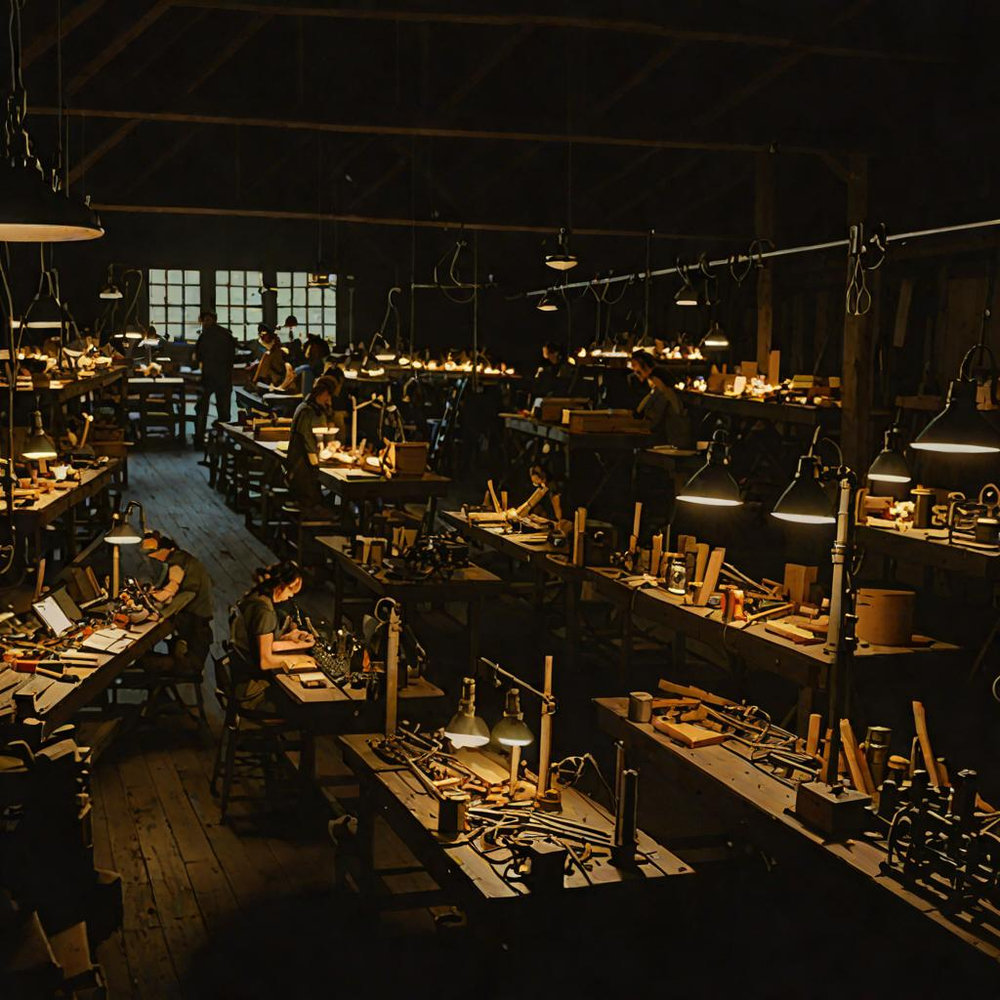

# Asset Ranch — Roblox-Style Asset Generation Pipeline



Local + cloud image generation tuned for the **Roblox look**: chunky, blocky,
saturated, flat-lit, toylike. Generated assets flow through a **catalog +
review gate** before ever entering a game repo (e.g. Scrapcraft, vibe-world).

## Lanes (spending doctrine)

| Lane | Runtime | Cost | When |
|------|---------|------|------|
| **LOCAL** | SDXL-Turbo via diffusers on the local RTX 4050 (`~/models/sdxl-turbo`) | free | use freely, iterate here |
| **CLOUD-FREE** | Cloudflare Workers AI `@cf/black-forest-labs/flux-1-schnell` (REST) | free quota | ongoing needs, higher prompt-fidelity than turbo |
| **RESERVED** | DeepInfra FLUX-2-max | per-token $ | **campaign-only, requires Casey's `--nod` flag** |

See `docs/LANES.md` for details. Never spend lane-c money without the nod.

## Layout

```
docs/STYLE-GUIDE.md     prompt kit: vocabulary, templates, negatives
docs/LANES.md           the three lanes, setup + policy
scripts/gen-local.py    LOCAL: diffusers SDXL-Turbo
scripts/gen-local.sh    LOCAL wrapper
scripts/gen-cf.sh       CLOUD-FREE: Workers AI flux-1-schnell
scripts/gen-deepinfra.sh RESERVED: FLUX-2-max, gated behind --nod
scripts/catalog.py      manifest + review gate (approve/reject/status)
scripts/qc-solidity.py  background-solidity QC (clean-cutout metric)
tests/test_catalog.py   gate logic tests
assets/<campaign>/<class>/  output + per-class manifest.json
```

## Flow

1. Pick a template from `docs/STYLE-GUIDE.md`.
2. Generate via a free lane: `scripts/gen-cf.sh "<prompt>" assets/foo/bar/baz.png`
3. Record: `scripts/catalog.py add --file ... --prompt ... --model ... --lane ...`
4. Review: `scripts/catalog.py review <id> --verdict approve|reject --note ...`
5. Only **approved** assets are copied into game repos. Ever.
